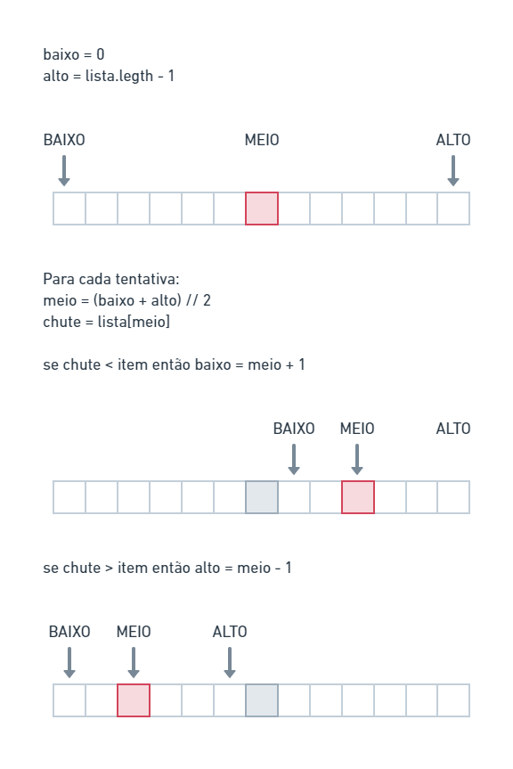

## Busca Binária

Com a busca binária, você chuta um número intermediário e elimina metade dos números restantes a cada vez. 

De maneira geral, para uma lista de *n* números, a pesquisa binária precisa de $\log_{2} n$ para retornar o valor correto, enquanto a pesquisa simples precisa de <i>n</i> etapas.

#### 🛑 Atenção: A pesquisa binária só funciona quando a lista está ordenada.

### 🔢 Logaritmos

A expressão $O(\log_{10} 100)$ basicamente diz: "Quantos 10s conseguimos multiplicar para chegar a 100?". Resposta: 2, 10 x 10.

- 🎥[Logaritmo (Curso Completo)](https://www.youtube.com/playlist?list=PLTPg64KdGgYiyW4u-g8y-dSkT1iz2cUKA)

### 💻 Código



[Código em Javascript](./algorithms/binary-search/main.js)

```javascript
function buscaBinaria(lista, item) {
    let baixo = 0;
    let alto = lista.length - 1;
  
    while (baixo <= alto) {
      let meio = Math.floor((baixo + alto) / 2);
      let chute = lista[meio];
  
      if (chute == item) {
        return meio;
      } else if (chute < item) {
        baixo = meio + 1;
      } else {
        alto = meio - 1;
      }
    }
    return null;
  }
```

### Exercícios 
1.1 Suponha que você tenha uma lista com 128 nomes e esteja pesquisando nela usando a pesquisa binária. Qual é o número máximo de passos que levaria?

Resposta: $\log_{2} 128 = 7$

1.2 Suponha que você dobre o tamanho da lista. Qual é o número máximo de passos agora?

Resposta: $\log_{2} 256 = 8$